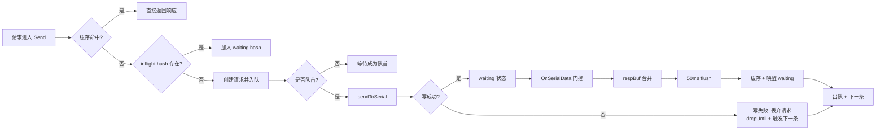
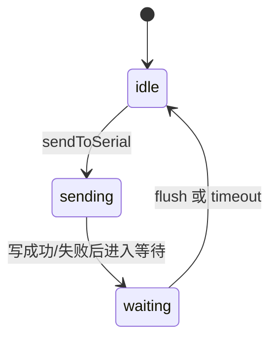

# Serial-Server

一个简单的串口服务器工具，支持将串口设备映射为 TCP 服务端口。

## 功能特性

- 多个串口设备映射到不同 TCP 端口
- 支持 UTF8、GB2312、HEX 三种显示格式
- 支持单客户端（踢旧连接）和多客户端模式
- 交互式配置向导
- 终端图形界面（TUI）

## 快速开始

### 编译

```bash
go build -o serial-server .
```

### 运行

```bash
# 有配置直接启动
./serial-server

# 无配置进入向导
./serial-server --wizard

# 列出可用串口
./serial-server --list

# 验证配置
./serial-server --check
```

## 使用教程

### 下载安装与权限

如果使用下载版二进制（Releases）：

```bash
chmod +x serial-server
```

### 启动与菜单导航

直接运行：

```bash
./serial-server
```

启动后会进入菜单：

- `1` 直接启动程序
- `2` 添加新配置（进入向导）
- `3` 修改配置
- `4` 删除配置
- `q` 退出

如果启动失败，会出现二次提示：

- `m` 交互式修改配置
- `e` 编辑配置文件
- 回车 重新加载配置

### 日志文件

- 运行日志：默认 `serial-server.log`
- 异常日志：`serial-server.issue.log`（记录丢包、无响应、写失败、超时清理等异常）

### 配置示例

```ini
[device_1]
listen_port = 9600
serial_port = /dev/cu.usbserial-1
baud_rate = 115200
data_bits = 8
stop_bits = 1
parity = N
display_format = UTF8

[device_2]
listen_port = 9601
serial_port = /dev/cu.usbserial-2
baud_rate = 9600
data_bits = 8
stop_bits = 1
parity = N
display_format = HEX
```

**配置参数说明：**

| 参数 | 必填 | 默认值 | 说明 |
|------|:----:|:------:|------|
| `listen_port` | ✅ | - | TCP 监听端口（1-65535） |
| `serial_port` | ✅ | - | 串口设备路径，如 `COM3` 或 `/dev/ttyUSB0` |
| `baud_rate` | ❌ | 115200 | 波特率：300/1200/2400/4800/9600/19200/38400/57600/115200 |
| `data_bits` | ❌ | 8 | 数据位：5/6/7/8 |
| `stop_bits` | ❌ | 1 | 停止位：1/2 |
| `parity` | ❌ | N | 校验位：N(无)/O(奇校验)/E(偶校验) |
| `display_format` | ❌ | UTF8 | 显示格式：HEX / GB2312 / UTF8 |

**多客户端队列机制：**

- 支持多个 TCP 客户端同时连接
- 客户端写入请求按 FIFO 顺序排队串行写入串口
- 串口响应按 FIFO 顺序匹配返回给对应客户端
- 相同数据的请求自动命中 5 秒缓存，无需重复写入串口
- 适合查询类命令（如读取传感器状态）

## 数据流程（简版）

1. 客户端请求进入 `WriteQueue.Send`，先查缓存，命中则直接返回。
2. 若 `inflight[hash]` 已存在，加入 `waiting[hash]` 等待同一响应。
3. 否则请求入队并成为 `inflight` 主请求，队首触发 `sendToSerial`。
4. 写串口成功后进入 `waiting` 状态，串口读到数据后进入 `respBuf`，50ms 无数据触发 flush。
5. flush 时返回响应给队首和所有等待者，写入缓存并发送下一条。
6. 超时清理会移除 pending/inflight/waiting，并设置短暂的 `dropUntil` 丢弃窗口。

以下是队列与响应的主要流程图（Mermaid）：





## 命令行参数

| 参数 | 说明 |
|------|------|
| `--wizard` | 强制进入交互式配置向导 |
| `--list` | 列出可用串口设备 |
| `--check` | 验证配置文件 |
| `--log file.log` | 输出日志到文件 |
| `--version` | 显示版本信息 |

## 下载发布版

从 [Releases](https://github.com/whysmx/serial-server/releases) 下载预编译的二进制文件。

## 更新日志

查看 [CHANGELOG.md](CHANGELOG.md) 了解详细的版本历史和问题修复记录。

## 文档

- [设计文档](docs/DESIGN.md) - 架构设计、多客户端队列机制、并发安全设计

## License

MIT
