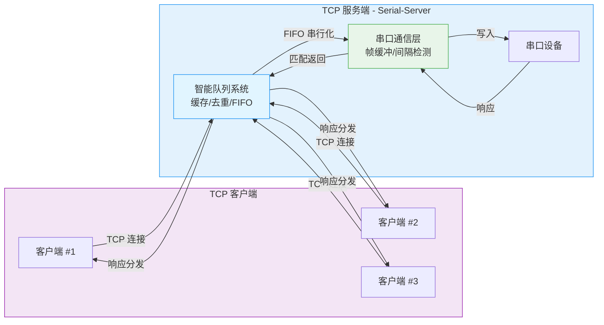
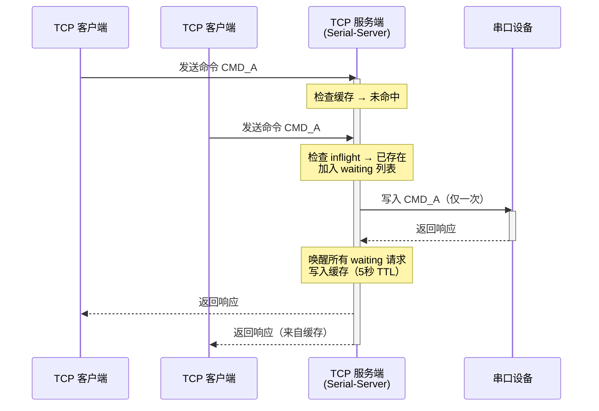

# Serial-Server

> 企业级串口服务器 - 将串口设备映射为 TCP 服务端口，支持多客户端并发访问和智能队列管理

[](https://go.dev/)
[](LICENSE)

## 为什么选择 Serial-Server？

Serial-Server 不是普通的串口转发工具，它专为**工业场景**和**多客户端并发**设计，核心优势：

- **智能队列系统** - 多个客户端请求自动排队串行化，支持请求去重和响应缓存
- **并发安全** - 采用"单一完成者"模式，避免竞态条件和资源泄漏
- **企业级稳定性** - 完善的超时处理、异常恢复、日志审计
- **零配置内网穿透** - 集成 FRP 自动管理，一键暴露串口服务
- **跨平台支持** - Windows/Linux/macOS，自动识别串口设备

## 核心架构



### 队列机制亮点



**关键技术**：
- **FNV-1a 64位哈希** - 计算请求指纹，实现自动去重
- **atomic.Bool 单一完成者** - 避免重复完成和竞态条件
- **50ms 帧间隔检测** - 自动合并分片数据，解决分包问题
- **3秒超时清理** - 自动清理过期请求，避免队列阻塞

## 功能特性

| 特性 | 说明 |
|------|------|
| **多客户端并发** | 支持无限个 TCP 客户端同时连接，请求自动排队 |
| **响应缓存** | 相同请求命中缓存，5秒内无需重复写串口 |
| **请求去重** | 相同命令只写一次串口，响应广播给所有等待者 |
| **帧缓冲机制** - 50ms 间隔检测，自动合并分片数据 |
| **并发安全** | atomic 操作 + 通道管理，无竞态条件 |
| **异常恢复** | 串口故障自动清理队列，启动失败提供恢复菜单 |
| **FRP 集成** | 一键添加内网穿透代理，自动生成配置 |
| **跨平台支持** | Windows COM1-256, Linux /dev/ttyUSB*, macOS /dev/cu.* |
| **日志审计** - 运行日志 + 异常日志（丢包/超时/写失败） |
| **交互式向导** | 自动扫描串口，引导配置，降低使用门槛 |

## 快速开始

### 安装

从 [Releases](https://github.com/whysmx/serial-server/releases) 下载对应平台的二进制文件：

```bash
# Linux/macOS
chmod +x serial-server
./serial-server

# Windows
serial-server.exe
```

### 首次运行

```bash
./serial-server
```

首次运行会自动进入配置向导：

1. 选择可用串口（自动扫描）
2. 配置 TCP 监听端口
3. 配置串口参数（波特率/数据位/校验位/停止位）
4. 选择显示格式（HEX/UTF8/GB2312）
5. 保存配置并启动

### 命令行参数

```bash
./serial-server              # 有配置直接启动，无配置进入向导
./serial-server --wizard     # 强制进入配置向导
./serial-server --list       # 列出可用串口
./serial-server --check      # 验证配置文件
./serial-server --log custom.log  # 指定日志文件
./serial-server --version    # 显示版本
```

## FRP 内网穿透集成

### 智能添加代理

程序内置 FRP 管理功能，无需手动编辑配置文件：

```
主菜单 → 5. FRP 管理 → 1. 添加代理
```

**自动完成**：
- 读取当前配置的所有监听器
- 为每个监听器生成 STCP 代理配置
- 自动生成唯一代理名称（避免冲突）
- 自动设置 `my_serial_server = true` 标记
- 上传配置到 FRP Dashboard（`http://localhost:7400/api/config`）

**代理命名规则**：

| 配置 | 生成的代理名称 |
|------|---------------|
| COM1:8001 | SERIALSERVER_COM1_8001 |
| /dev/ttyUSB0:8002 | SERIALSERVER_ttyUSB0_8002 |

### FRP 管理菜单

```
1. 添加代理  - 智能添加所有监听器的 FRP 代理
2. 查看配置  - 显示当前 FRP 服务器的所有代理配置
3. 清理代理  - 删除所有 my_serial_server 标记的代理
b. 返回
```

### 技术实现

程序通过 FRP Dashboard API 自动管理配置：

```go
GET  http://localhost:7400/api/config  // 获取当前配置
PUT  http://localhost:7400/api/config  // 上传新配置
认证：Basic Auth (admin/admin)
```

## 日志系统

### 日志文件

| 日志文件 | 说明 |
|---------|------|
| **serial-server.log** | 运行日志（连接、数据传输、配置变更） |
| **serial-server.issue.log** | 异常日志（丢包、超时、写失败、竞态检测） |

### 日志格式

```
[device_1_#1] [→] [9B] 68 03 03 68 99 84 26 21 16  # 发送数据
[device_1_#1] [←] [49B] 68 68 36 36 68...          # 接收数据
[listener:device_1] client connected 127.0.0.1:51164 -> #1 (total: 1)
[queue:device_1] cache hit: hash=1234567890
[queue:device_1] timeout cleanup: removed 1 pending requests
```

### 异常事件记录

程序会记录以下异常到 `issue.log`：

- **丢包**：串口响应无法匹配到任何请求（在丢弃窗口内）
- **超时**：请求 3 秒未响应，自动清理
- **写失败**：串口写入失败，请求丢弃
- **竞态检测**：发现潜在的并发安全问题

## 开发与测试

### 运行测试

```bash
# 单元测试
go test ./...

# 集成测试（需要虚拟串口）
go test -tags=integration ./...

# 竞态检测
go test -race ./...

# 基准测试
go test -bench=. -benchmem ./...

# 覆盖率报告
go test -coverprofile=coverage.out ./...
go tool cover -html=coverage.out
```

### CI/CD 流水线

项目包含完善的 CI/CD：

- **多平台编译验证** - Windows/Linux/macOS
- **代码质量检查** - gofmt, govet, golangci-lint
- **安全扫描** - GoSec, Snyk, govulncheck
- **自动发布** - 推送 tag 自动构建 Releases

## 技术细节

### 串口参数支持

| 参数 | 支持值 |
|------|--------|
| **波特率** | 300, 1200, 2400, 4800, 9600, 19200, 38400, 57600, 115200 |
| **数据位** | 5, 6, 7, 8 |
| **停止位** | 1, 2 |
| **校验位** | N(None), O(Odd), E(Even) |

### 性能指标

| 指标 | 数值 |
|------|------|
| **编译后大小** | ~8.6 MB（静态编译） |
| **内存占用** | < 20 MB（10 个监听器） |
| **请求超时** | 3 秒 |
| **缓存 TTL** | 5 秒 |
| **帧间隔检测** | 50 ms |

### 并发安全设计

- **atomic.Bool** - 确保每个请求只完成一次
- **sync.RWMutex** - 保护客户端列表和队列数据
- **channel 缓冲** - 避免阻塞，提高吞吐量
- **单一完成者模式** - 避免重复关闭通道和 double send

## 更新日志

查看 [CHANGELOG.md](CHANGELOG.md) 了解详细的版本历史。

## 文档

- [设计文档](docs/DESIGN.md) - 架构设计、队列机制、并发安全

## License

MIT License - 详见 [LICENSE](LICENSE)
